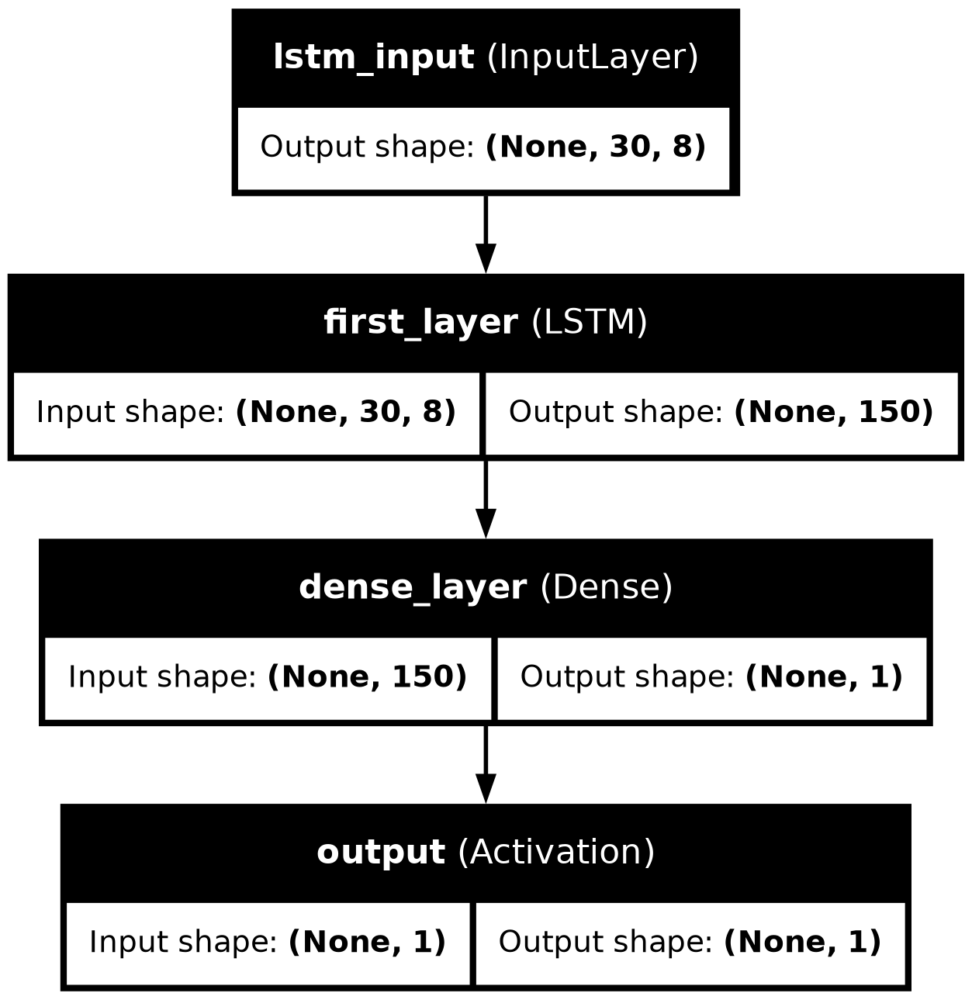

# Stock Price Prediction 

This project implements a Long Short-Term Memory (LSTM) neural network model to predict stock prices based on historical data.

## Overview

This project uses a Long Short-Term Memory (LSTM) neural network to predict stock prices. LSTM is a type of recurrent neural network (RNN) that is well-suited for sequential data like time series. The model is trained on NIFTY 50-min data and can be used to make predictions on future stock prices for Indian stock market.

## Requirements

-   Python 3.7+
-   TensorFlow 2.x
-   Keras
-   Pandas
-   NumPy
-   Matplotlib
-   Scikit-learn

## Data

The project uses historical stock price data obtained from [kaggle](https://www.kaggle.com/datasets/debashis74017/nifty-50-minute-data).  This data contains all the indices of NSE. 
The data is preprocessed and normalized before being fed into the LSTM model.

## Model Architecture

Two LSTM models were made, one uses last 30 days data and other uses last 60 days data. The LSTM model architecture consists of:

-   **Input Layer (`lstm_input`)**:
    
    -   Shape: `(backcandles, 8)` where `backcandles` is the number of time steps and 8 is the number of features per time step.
    -   Name: `'lstm_input'`.
-   **LSTM Layer (`first_layer`)**:
    
    -   150 units (neurons).
    -   It processes sequences and retains temporal information.
-   **Dense Layer (`dense_layer`)**:
    
    -   1 unit.
    -   A fully connected layer that reduces the dimensionality to 1 output.
-   **Activation Layer (`output`)**:
    
    -   Linear activation function (suitable for regression tasks).
-   **Model Compilation**:
    
    -   Optimizer: Adam (Adaptive Moment Estimation).
    -   Loss: Mean Squared Error (`mse`), used for regression problems.

## Training

The model is trained on historical data, using a portion of the data for training and the rest for validation. The training process can be customized by adjusting hyperparameters such as batch size, number of epochs, and learning rate.

## Evaluation

The model's performance is evaluated using metrics such as Mean Squared Error (MSE), Root Mean Squared Error (RMSE), Mean Absolute Error(MAE), R-Squared error. 

The evaluation results are displayed after training and can also be visualized using plots. The results are further evaluated on residuals, directional accuracy, Sharpe ratio and maximum drawdown.  These metrics make the results of the model, further trust worthy of risk analysis in real-life stock trading.

## Results

The prediction charts of both the models are shown here.

## License
MIT License 

## Contact me 

      
     
  
   

